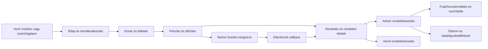

# Food Pro rendszerelemzés és mobilos fejlesztés

Az elemzés a Food Pro vevőoldalát, adminját, rendelési és fizetési folyamatait, adatmodelljét és üzemeltetési alapjait vizsgálja. Célja egy modern, telefonon is könnyen használható éttermi rendelési rendszer. Ellenőrzési dátum: 2026. október 2.

A projekt jó alap egyetlen étterem saját étlapjához, vendégrendeléséhez, elviteléhez és kiszállításához. Az üzembiztos éles használathoz azonban még szükséges a jogosultságok, kuponok, rendelési konkurencia és kapacitáskezelés javítása, valamint a támogatott keretrendszerre történő átállás. A jelen változtatás a vevőoldal mobilos használatát fejleszti; a jelentésben szereplő szerveroldali hiányokat külön fejlesztési feladatként rögzíti.

## Vizsgálati hatókör és bizonyíték

Az admin és a rendelési folyamat külön forráskód-áttekintést kapott. A megállapítások mellett szereplő fájl és sor a vizsgált kódra utal. A kód által igazolt hiány és a lehetséges következmény külön értelmezendő: a párhuzamos rendelésből eredő hibákhoz például terheléses reprodukció szükséges. A vizsgálat nem éles penetrációs teszt, teljes függőségi sérülékenységvizsgálat vagy jogi megfelelőségi tanúsítás.

A helyi ellenőrzések külön tesztadatbázist használnak. Valós vásárlóadat, éles rendelés, fizetési kulcs és külső üzenetküldés nem szükséges a mobilos módosítások kipróbálásához. A böngészős és automatikus ellenőrzések eredménye a dokumentum végén található.

## Termék és architektúra

Laravel 9.52.16, szerveroldali Blade nézetek, Bootstrap 5, jQuery, Owl Carousel és saját JavaScript alkotják a rendszert. A rendelés adatai relációs adatbázisban vannak. A vevőoldal és az admin ugyanabban az alkalmazásban fut. A PHP-függőségeket Composer kezeli; a jelen vevőoldali CSS és JS közvetlenül a `public` könyvtárból töltődik be.

A konfiguráció több helyen `Settings::first()` és globális helper alapján működik. A vizsgált rendszer egyéttermes telepítésként értelmezhető. Több étterem közös SaaS rendszeréhez étteremazonosító, adat- és jogosultsági elkülönítés, külön konfiguráció, domainkezelés és számlázási modell kellene. Ezek megléte nem igazolt.

### Adatmodell

A fő kapcsolatok: kategória → alkategória → termék → termékkép; termék → feltétcsoport → feltét; session vagy vásárló → kosár; rendelés → rendelési tétel; rendelés → vásárló/futár/státusz; Barion tranzakció → fizetési draft és létrehozott rendelés. A rendelési tételek neveket, árakat és választásokat pillanatképként őriznek, ami fontos a későbbi katalógusmódosítások mellett.

A kezdő SQL és a későbbi migrációk együtt adják a telepítési alapot. A `migrate` önmagában nem igazolt teljes, üres adatbázist felépítő telepítésként. A pénzmezők között szöveges, egész és lebegőpontos típusok is vannak, a kapcsolatok és indexek pedig hiányosak. A pénzügyi számításokhoz egységes `DECIMAL` vagy a legkisebb pénzegységben tárolt egész érték, kifejezett idegen kulcsok és keresési indexek javasoltak. Az éles adatbázis sémája külön ellenőrzendő.

## Funkcionális leltár

| Terület | Jelenlegi állapot | Következő szükséges lépés |
| --- | --- | --- |
| Étlap és keresés | Aktív kategóriák, termékek, név szerinti keresés, lapozás, akciók. | Napi elérhetőség érvényesítése a vevőoldalon; ár és választások újraellenőrzése rendeléskor. |
| Termékválasztás | Képek, allergének, feltétcsoportok, kötelező/minimum/maximum választás, extra, speciális kérés. | Allergén- és képtartalom éttermi ellenőrzése; hosszú választások mobilos tesztje. |
| Kosár | Vendég és bejelentkezett kosár, mennyiség, törlés; belépéskor kosárátadás. | Árváltozás és kupon újraszámítása; párhuzamos módosítások kezelése. |
| Pénztár | Vendégrendelés, vevőadat, elvitel/kiszállítás, zóna, nyitvatartás, későbbi idősáv. | Szerveroldali végső kiszállítási és mennyiségi ellenőrzés; kapacitásfoglalás. |
| Fizetés | Készpénz, átvételkori terminálos kártya; Barion konfigurálható teszt/éles környezettel. | Saját kereskedői adatokkal sandbox E2E, visszatérítés és egyeztetés; éles bevezetés még nem igazolt. |
| Vevői fiók | Regisztráció, ellenőrzés, belépés, profil, címjegyzék, kedvencek, rendeléstörténet. | Valós levélkézbesítés, konzisztens resetlinkes folyamat és hűségszabályok. |
| Rendeléskövetés | Saját rendelésrészlet és státusz; vendégnél sessionhez kötött hozzáférés. | Állapottörténet és valós elkészítési/kézbesítési becslés. |
| Admin rendeléskezelés | Lista, szűrés, státuszváltás, megjegyzés, futárhozzárendelés, nyomtatás/PDF. | Átmenetvédelem, műveleti audit, pénzügyi megerősítés jogosultsága. |
| Katalógusadmin | Kategóriák, termékek, képek, feltétek, adók, elérhetőség szerkesztése. | Üzleti validáció, napi elérhetőség teljes rendelési folyamatba kötése. |
| Éttermi beállítások | Heti nyitvatartás, szünetek, időablak, szállítási terület/díj, megjelenés, navigáció. | Ünnepnap/rendkívüli zárás, terhelés miatti rendelési szünet, címhatárok. |
| Riportok | Dashboard és dátum szerinti rendelési riport. | Zárónap és státuszazonosítók javítása; szerveroldali lapozás. |
| Munkatárs és szerepkör | Felhasználók, szerepköradatok, modul alapján változó menü. | Szerveroldali moduljogosultság; tiltott munkatárs sessionjének visszavonása. |
| Asztalfoglalás | Kérelem, elfogadás/elutasítás és értesítési nézet. | Valós kézbesítés és kapacitáskezelés külön próbája. |
| CMS és marketing | Jogi/tájékoztató oldalak, GYIK, galéria, slider, banner, hírlevél, kupon. | Éttermi tartalomcsere, SEO, ténylegesen használt modulok egyszerűsítése. |
| POS, API, PWA és import | Fájlok/modulnyomok vannak, több kapcsolódó route fájl üres. | Működő végpont és end-to-end próba nélkül nem tekinthetők kész funkciónak. |

A menüben vagy adatbázisban látható modult nem szabad automatikusan működő funkciónak tekinteni. Több route fájl nulla bájtos, köztük `api.php`, `pos.php`, `pwa.php`, `import.php`, `emailsettings.php` és `custom_status.php`. Az egyedi státuszokat a rendeléskezelés használja, de önálló státuszadmin CRUD a vizsgált route fájlból nem következik.

## Vevőoldal és mobilos változtatások

### Elkészült változtatások

- A kezdőoldalon és a kategóriaoldalon közvetlen ételkereső, étlapgomb és nyitvatartásgomb segíti a rendelés kezdetét. A mobilos hero alacsonyabb, így hamarabb elérhetők a rendelési elemek.
- Vízszintesen görgethető, görgetés közben is elérhető kategóriasáv került a kezdő-, kategória- és étlapoldalra. Az aktív kategória látható és jelölt. Az étlap saját kategóriacímet és találatszámot mutat.
- A fejléc keresője GET űrlapként küldi az étel nevét. Korábban a mező mellett álló link nem adta át a beírt keresést. Mobilon külön fejléc-kosárgomb érhető el.
- Keskeny kijelzőn a termékkártya kompakt kép–szöveg elrendezést használ. A napi ajánlatok és ajánlott ételek is a közös kártyát használják; ezzel a kezdőoldal keskeny képernyőn tapasztalt túlcsordulása megszűnt. Az allergéngomb valódi, billentyűzettel is kezelhető gomb, a képek ételnév szerinti alternatív szöveget és késleltetett betöltést kaptak. Értékelés nélküli ételnél nem jelenik meg félrevezető nulla csillagos értékelés.
- A mennyiséggombok és fő műveletek legalább 44 px érintési célt kapnak. A mobil űrlapmezők legalább 16 px betűméretet használnak, a külön belépési/regisztrációs nézetekben is; a pénztár név- és címmezői automatikus kitöltési jelölést kaptak.
- A kosársáv az első kosárba helyezés után is azonnal megjelenik, minden kosárjelző frissül. A jelzők a darabszámot mutatják: a kosárba helyezési válasz új `cart_quantity` mezőt kapott, a korábbi `data` mező megmaradt. A teljes sáv kattintható. A mobil alsó navigáció felett jelenik meg, a tartalom pedig helyet hagy mindkettőnek.
- A termékmodal telefonon alulról megjelenő felület, görgethető választásokkal és elérhető műveleti lábléccel. A mennyiségválasztó nagyobb kijelzőn is saját sort kap.
- Kijelzőszegélyhez tartozó biztonságos terület, látható billentyűzetfókusz, tartalomra ugró link és csökkentett mozgást kérő böngészőbeállítás támogatása készült.

A 44 × 44 CSS px tervezési cél a WCAG 2.2 emelt érintésicél-ajánlásához igazodik; önmagában nem teljes akadálymentességi megfelelőségi bizonyíték. Az AA minimum eltér, 24 × 24 CSS px, kivételekkel. [WCAG célméret](https://www.w3.org/TR/WCAG22/#target-size-enhanced), [WCAG minimum célméret](https://www.w3.org/TR/WCAG22/#target-size-minimum).

A CSS-kiegészítés megőrzi az éttermi színválasztást és évszakos témákat. A közvetlenül kiszolgált CSS/JS időbélyeges URL-t kap, így frissítés után a böngésző a megváltozott fájlt tölti be. A frontendhez nincs szükség új frameworkre vagy buildlépésre.

### További vevőoldali fejlesztések

Az étlap legyen a leggyakoribb rendelési belépési pont. Hosszabb távon egységes főétlap, nyitott/zárt állapot és valós elkészítési becslés, választható kiszolgálási mód, világos minimumösszeg és díj, valamint készlethiány esetén érthető visszajelzés ajánlott. A cím és a szállítási zóna összetartozását a szerver is ellenőrizze. A termékoldali allergénadat és a tényleges ételösszetétel maradjon az étterem által gondozott tartalom.

## Elsődleges szerveroldali javítások

P0: éles bevezetés előtt rendezendő. P1: rendelésbiztonságot vagy pénzügyi/üzemi helyességet érint. P2: fontos következő fejlesztés. A prioritás e jelentés értékelése; nem automatikus sérülékenységi pontszám.

| Prioritás | Kóddal igazolt hiány | Hatás és szükséges javítás | Forrás |
| --- | --- | --- | --- |
| P0 | Az `AdminAuth` az 1/4 típusú felhasználót engedi át; a moduljogosultság menüelrejtésre épül. | Korlátozott munkatárs közvetlen végpontkéréssel szélesebb adminművelethez férhet hozzá. Minden admin művelethez policy/gate vagy moduljogosultság szükséges. | `app/Http/Middleware/AdminAuth.php:24`, `resources/views/admin/theme/sidebarcontent.blade.php:1`, `routes/role.php:18` |
| P0 | Kupon minimum és százalékos kedvezmény kliens által küldött `order_amount` alapján készül, majd sessionből levonódik. | Manipulált összeg túlzott kedvezményt adhat. Kosárból képzett, közös szerveroldali kuponszámítás kell, a végső rendelésnél ismételten. | `front/PromocodeController.php:27,34,50`, `front/CheckoutController.php:337`, `BarionController.php:117` az `app/Http/Controllers` alatt |
| P1 | A közvetlen rendelésmentés nem egyetlen DB-tranzakció és nincs idempotenciakulcs. | Kettős beküldés vagy köztes hiba duplikált/részleges rendelést eredményezhet. Tranzakció, egyedi beküldési kulcs és foglalt kosárverzió szükséges. | `app/Http/Controllers/front/CheckoutController.php:403–600` |
| P1 | A végső rendelés nem ellenőrzi újra a kosártermék aktuális állapotát/árát; `today_unavailable` vevőoldali érvényesítése hiányzik. | Korábban kosárba tett, módosított vagy ma nem rendelhető étel elfogadható maradhat. Közös termék- és feltétvalidáció kell kosárba vételnél és véglegesítésnél. | `front/CartController.php:83`, `front/CheckoutController.php:285–338`, `BarionController.php:70` |
| P1 | A kiszállításvédő middleware csak a nem létező `validate_data()` metódusra mutató route-on van. | A végleges rendelés és Barion indítás közvetlenül megkerülheti a kiszállítás kikapcsolását. A végső szerveroldali ellenőrzés hibát adjon, ne írja némán elvitelre a rendelést. | `routes/web.php:86,174,177`, `app/Http/Middleware/EnsureDeliveryAvailable.php:25` |
| P1 | A maximális rendelési darabszám a közvetlen véglegesítésből hiányzik. | Több kosársorral túlléphető a soronként ellenőrzött limit; az előellenőrzési végpont kihagyásával a közvetlen véglegesítés ezt elfogadhatja. Az összes darabot a véglegesítési tranzakcióban kell ellenőrizni. | `app/Http/Controllers/front/CheckoutController.php:136,285` |
| P1 | Idősávkapacitás egyszerű count, nincs foglalási zárolás; lemondott rendelés is számít. | Párhuzamos rendelés túlfoglalást, lemondott rendelés hamis telítettséget okozhat. Atomi kapacitásfoglalás és megfelelő státuszszűrés kell. | `app/Support/OrderTiming.php:119–125` |
| P1 | A rendelési sorszám az utolsó sorból készül; a starter sémában nincs egyedi index az order_number mezőre. | Egyidejű rendelések azonos számot kaphatnak. Adatbázis által garantált egyedi azonosító szükséges. | `front/CheckoutController.php:403`, `BarionController.php:454`, `database/food_pro_starter.sql:639–676` |
| P1 | Barion véglegesítés az ügyfél/session teljes aktuális, azonos `buynow` típusú kosarát törli. | Fizetés közben hozzáadott új tétel is elveszhet. Csak a fizetési draftban foglalt sorokat/verziót szabad törölni. | `app/Http/Controllers/BarionController.php:543–548` |
| P1 | Letiltott alkalmazottat csak a bejelentkezés ellenőriz, az aktív sessiont az admin middleware nem. | A letiltás későbbi kéréseknél hatástalan maradhat. Folyamatos állapotellenőrzés és sessionvisszavonás kell. | `admin/AdminController.php:148`, `app/Http/Middleware/AdminAuth.php:24` |
| P1 | Az admin státuszváltás külön műveletekben történik, következetes átmenetvédelem nélkül. | Teljesített rendelés visszaléphet; párhuzamos wallet-visszatérítés kockázata áll fenn. Állapotgép, sorzár, tranzakció és eseménynapló szükséges. | `app/Http/Controllers/admin/OrderController.php:45–120` |
| P1 | Fizetettnek jelölés kliensmező alapján történik, részletes összeg/típus/jogosultság validáció nélkül. | Manuális pénzügyi művelet nincs megfelelően korlátozva és naplózva. Rendeléshez és fizetési módhoz kötött megerősítés kell. | `app/Http/Controllers/admin/OrderController.php:236–244` |
| P1 | Riport fix 5/6/7 státuszazonosítókkal számol; dátumos záróhatár éjfél. | Egyedi státusz és zárónap mellett hibás darabszám/bevétel lehetséges. Státusztípus és teljes nap szerinti szűrés kell. | `app/Http/Controllers/admin/OrderController.php:224–230` |
| P1 | A napi termék-visszaállító parancs nincs az üres schedulerbe kötve. | A „ma nem elérhető” állapot másnap is megmaradhat. Dátumspecifikus elérhetőség vagy ellenőrzött ütemezés szükséges. | `app/Console/Commands/ResetItemAvailability.php:12,23`, `app/Console/Kernel.php:16` |

Pozitív különbség a Barion callbackben: a kód szolgáltatói állapotlekérést, összegellenőrzést, DB-tranzakciót, sorzárat és ugyanazon fizetési azonosító ismételt feldolgozása elleni védelmet tartalmaz (`BarionController.php:332–423`). Ez megfelelő kiindulás, de a két külön fizetésből/kosárbeküldésből eredő versenyhelyzeteket önmagában nem rendezi.

### Második körös helyességi feladatok

- Futárhozzárendeléskor a felhasználó típusát, elérhetőségét és a rendelés állapotát ellenőrizni kell (`admin/OrderController.php:127–158`).
- Szállítási zóna városegyezés hiányában választott ID-ra esik vissza; térbeli/címalapú kiszolgálhatóság nem igazolt (`front/CheckoutController.php:313`).
- Százalékos adóalap az extrákat kihagyja; a kívánt adózási/árképzési szabályt üzletileg egyeztetni kell (`front/CheckoutController.php:331`, `BarionController.php:112`).
- Hűségjóváírás a külön rendelési ágakon eltér (`front/CheckoutController.php:573`, `BarionController.php:554`). Egységes, dokumentált szabály szükséges.
- Az átvételkori kártyás, még ki nem fizetett rendelés vevői lemondását a típusellenőrzés tiltja (`front/OrderController.php:43`).
- A régi vevőcontroller e-mailben küld új jelszót; a ténylegesen elérhető resetútvonalakkal együtt kell rendezni (`front/UserController.php:369–379`, `routes/web.php:50–66`).
- Az admin rendeléslista/riport minden találatot betölt. Nagy történetnél szerveroldali lapozás és megfelelő index szükséges (`admin/OrderController.php:34,225`).
- Nyitvatartás és díj mentése üzleti validációt igényel: érvényes intervallum, pozitív slotlimit, nem negatív díj (`admin/TimeController.php:21–37`, `admin/ShippingareaController.php:20–33`).

## Éttermi operáció és további modulok

Egy modern étteremnek a rendelési weboldal mellett a pult és konyha munkáját is támogatni kell. A következő képességek a vizsgált kódban nem igazoltak kész modulnak:

| Képesség | Javasolt viselkedés |
| --- | --- |
| Konyhai képernyő | Új, készülő, átadásra kész rendelések; eltelt idő, határidő, nagy kezelőgombok és tételes készrejelölés. |
| Műszak és kapacitás | ASAP terhelési limit, késés esetén módosított becslés, átmeneti rendelési szünet. |
| Futárfelület | Csak saját kiosztott rendelések, átvétel/kézbesítés visszajelzés, szükséges cím és telefon. |
| Eseménytörténet | Ki, mikor, mit változtatott a státuszon, fizetésen, áron vagy címadatokon. |
| Kivételek kezelése | Ünnepnap, rendkívüli zárás, hiányzó termék, részleges teljesítés, visszatérítés. |
| Pénzügyi egyeztetés | Rendelés és fizetés összevetése, sikertelen callback újraellenőrzés, refundállapot, napi zárás. |
| Nyomtatóintegráció | Pult/konyha rendelési bizonylat, újranyomtatás jelölése, nyomtatási hiba visszajelzése. |

Ezeket érdemes fokozatosan bevezetni. Első lépés a jelen rendelési életciklus biztonságossá tétele, majd a konyhai képernyő és állapottörténet. Több étterem vagy teljes POS rendszer külön termékbővítés lenne.

### Admin használhatóság

A jelen admin részletes karbantartófelület. Az éttermi műszak számára egyszerűbb, szerepkörre szabott belépőnézet szükséges: az új és késő rendelés, az átvétel módja, az időpont és a fizetettség legyen azonnal látható. A hosszú katalógus- és CMS-menü helyett a konyha, pult és futár a saját műveleteit kapja. Az admin mobilos modernizálása külön fejlesztés; a jelen patch a vevőoldalt módosítja.

| Felület | Javasolt javítás |
| --- | --- |
| Rendeléslista | Prioritás és eltelt idő, kiemelt új rendelés, gyors részlet és egyértelmű következő státusz; nagy mennyiségnél szerveroldali lapozás. |
| Fizetési művelet | Külön fizetettség és rendelési státusz, jogosult személy által végzett megerősítés, eseménynapló és visszatérítési állapot. |
| Nyitvatartás | „Most fogad rendelést” állapot, következő nyitás, rendkívüli zárás és kapacitás miatti szünet közös nézetben. |
| Beállítások | Katalógus, rendelés, fizetés, megjelenés és üzemeltetés világos csoportjai; kapcsolódó mezők és hibák együtt. |
| Nyelv | Az adatlisták jelenlegi angol feliratait is magyarítani kell; a lemondott rendelés „Törölve” felirata legyen üzletileg egyértelmű. |

A helyi, rendelést nem tartalmazó admin render a menüt és listakeretet igazolja. Nem bizonyítja a munkatárs-jogosultságok vagy a státuszváltások helyességét.

## Üzemeltetés és karbantarthatóság

### Támogatott platform

A Laravel 9 biztonsági támogatása 2024. február 6-án véget ért. A PHP 8.1 támogatása 2025. december 31-én véget ért; a PHP 8.2 biztonsági támogatása 2026. december 31-ig, a PHP 8.3-é 2027. december 31-ig tart. A Laravel 9 hivatalos táblázata PHP 8.0–8.2 kompatibilitást jelöl. Ezek támogatási tények, nem konkrét sérülékenység bizonyítékai. [Laravel támogatási szabályzat](https://laravel.com/docs/9.x/releases#support-policy), [PHP támogatott verziók](https://www.php.net/supported-versions.php), [PHP lezárt verziók](https://www.php.net/eol.php).

A helyi Composer-próba szerint a jelen lock PHP 8.4 alatt nem telepíthető több csomag felső verziókorlátja miatt; PHP 8.1 alatt a Barion minimum PHP 8.2 követelménye akadály. A lock gyakorlati telepítési metszete PHP 8.2/8.3, de a PHP 8.3 helyi sikeres próba sem ad hivatalos Laravel 9 támogatást. A tartós megoldás támogatott Laravel/PHP verziópárra és friss, ellenőrzött függőségekre történő migráció.

### Telepítés és működés

A README helyesen elkülönített nyilvános webgyökeret ír elő és tiltja a régi webes telepítőt. A forrás, `.env`, adatbázis és mentés maradjon a webgyökéren kívül. Az egyszeri demo seeder meglévő katalógusállapotokat és tartalmat is átír, ezért működő ügyféladatbázis rendszeres frissítésekor nem szabad futtatni.

Az alapkonfiguráció fájlos cache/sessiont és azonnali (`sync`) sort használ. SMTP és tényleges levélkézbesítés nélkül a regisztráció és rendelési értesítés üzemi működése nem igazolt. A rendelésmentést és levélküldést külön, hibatűrő folyamattá érdemes szervezni; küldési hiba ne ösztönözze ugyanazon rendelés újbóli beküldését.

A `helper::sendmail()` kivételnél naplózás nélkül `0` értékkel tér vissza; a státuszváltás vezérlője az eredményt nem ellenőrzi (`app/Helpers/helper.php:178–195`, `admin/OrderController.php:106`). Az alap napló egyetlen fájlba ír, a napi rotáció külön csatorna (`config/logging.php:20,56–70`). Ezek konfigurációs alapértékek; az éles környezet állapota nem volt ellenőrizhető.

A napi elérhetőség visszaállítására van `items:reset-7am` parancs, de az alkalmazás ütemezőjében nincs bejegyezve (`app/Console/Commands/ResetItemAvailability.php:12,23–28`, `app/Console/Kernel.php:16–18`). Külső cron megléte nem igazolt. Dedikált health végpontot és automatizált backupfolyamatot a vizsgált alkalmazás-, route- és deploykódban nem találtam; ez külső tárhelymentés hiányát nem bizonyítja.

Több nézet, modell és helper közvetlenül `env('ASSETSPATHURL')` értéket olvas (`resources/views/web/layout/default.blade.php:14,29`, `app/Models/Order.php:14,18`, `app/Helpers/helper.php:249`). Konfigurációcache mellett ezt konfigurációs kulcsba kell áthelyezni és a telepítést ellenőrizni. A GET `/admin/clear-cache` az egész cache-t üríti (`routes/web.php:501–505`), beleértve a Barion visszatérési és hűségbónusz-védelmi kulcsait (`BarionController.php:268,284,556–569`, `front/CheckoutController.php:577–584`). Az üzleti idempotenciát tartós adatbázisállapotnak kell biztosítania; ismételt bónuszjóváírást e vizsgálat nem reprodukált.

A jelen helper és nézetek több ismételt adatbázis-lekérést végeznek. Az étterembeállítás, nyelvek, kategóriák és időadatok kérésenkénti közös betöltése és változáskor érvénytelenített cache javíthatja a válaszidőt. Az új mobilos CSS nem helyettesít adatbázis- vagy szerverterhelési mérést.

Az alaplap OG mezőket tartalmaz, de egyedi oldalleírás, canonical és éttermi strukturált adatok teljes körű megléte nem igazolt. SEO és közösségi előnézet külön ellenőrzési kör legyen, valós éttermi névvel, címmel és saját fotókkal.

### Üzemeltetési átadáshoz szükséges bizonyíték

- Visszaállítható adatbázis-, feltöltés- és konfigurációmentés, tényleges visszaállítási próbával.
- HTTPS, nem nyilvános konfiguráció, egyedi adminhozzáférés, megfelelő logszint és hibakijelzés.
- Működő levelezés igazolt rendelési és regisztrációs kézbesítéssel.
- Rendelési/fizetési hibák figyelése, azonosítható rendelési események, fizetési egyeztetés.
- Élesítés előtti migrációs és visszaállítási terv, független fejlesztői/teszt/éles környezet.
- Étteremre szabott tájékoztatók, valós díjak/nyitvatartás/allergének, a forrás és képek felhasználási jogának rendezése.

A kezdő SQL egyik WhatsApp seedértéke hitelesítőadatnak tűnik (`database/food_pro_starter.sql:1462`). A jelentés nem tartalmazza az értéket, és nem ellenőrizte annak érvényességét. A forrásadat tisztítása és szükség esetén kulcscsere külön feladat; a helyi tesztadatbázisba ilyen szolgáltatói hitelesítők nem kerülnek.

## Javasolt megvalósítási sorrend

1. **Élesítési alapok:** P0 jogosultság és kuponjavítás; támogatott platformra migráció terve; tiszta tesztadatbázis és üzleti tesztek.
2. **Megbízható rendelés:** közös árazás/elérhetőség/díjellenőrzés, tranzakció és idempotencia, egyedi sorszám, kapacitásfoglalás, Barion draft szerinti kosártörlés.
3. **Megbízható admin:** státuszátmenetek, műveleti napló, fizetési megerősítés, státusztípuson alapuló és teljes napot tartalmazó riport.
4. **Éttermi műszak:** konyhai képernyő, készítési becslés, terhelési szünet, rendkívüli nyitvatartás, futárfelület.
5. **Üzemi bizonyítás:** sandbox fizetés, levélkézbesítés, nyomtatás, mentés-visszaállítás, terhelés és valódi telefonos használat.
6. **Termékbővítés:** térképes zónák, integrált nyomtató/POS, PWA, API vagy többéttermes működés a tényleges ügyféligények alapján.

### Szükséges üzleti elfogadási tesztek

- Korlátozott munkatárs közvetlen admin GET/POST kérése is tiltott; felfüggesztés után a már belépett session sem használható.
- Manipulált kuponösszeg, lejárt kupon és kupon után megváltozott kosár esetén csak az érvényes, szerveroldalon számított kedvezmény kerül a rendelésbe.
- Dupla kattintás, ismételt beküldés és köztes hiba után egyetlen teljes rendelés, egyedi sorszám és helyes kosárállapot marad.
- Kikapcsolt kiszállítás, túlzott darabszám, nem elérhető étel vagy feltét, illetve időközben módosított ár minden fizetési ágon szabályos visszajelzést ad.
- Az utolsó szabad idősávra párhuzamosan érkező kérések közül csak a kapacitásba beleférő rendelés fogadható el; lemondás felszabadítja a kapacitást.
- Ismételt Barion callback nem hoz létre új rendelést vagy bónuszt; sikertelen/lejárt fizetés kezelhető, a fizetés közben hozzáadott új kosártételek megmaradnak.
- Státuszváltás, fizetettség és refund csak engedélyezett átmenettel, megfelelő jogosultsággal és visszakereshető eseménnyel történik.
- A riport tartalmazza a zárónap késő esti rendeléseit, és eltérő státuszazonosítókkal is a helyes üzleti státuszokat összesíti.
- Levélküldési hiba nem veszít rendelést és nem okoz duplikációt; tényleges kézbesítés, nyomtatás és mentésből visszaállítás külön igazolt.

## Ellenőrzések és átadási állapot

A próbák külön, Git által figyelmen kívül hagyott SQLite tesztadatbázison, PHP 8.3.35 alatt, csak `127.0.0.1:8093` címen futottak. A helyi levélküldő `log`, külső fizetés és üzenetküldés nincs bekapcsolva. A Composer lock és az alkalmazás általános környezetkonfigurációja nem változott.

| Ellenőrzés | Eredmény és bizonyíték korlátja |
| --- | --- |
| Reszponzív oldalak | **32/32 sikeres:** kezdőlap, kategóriák, pizzák étlapja, pizza keresés, termékoldal, kosár, pénztár és belépés 320, 390, 768 és 1440 CSS px szélességen. Az oldalak nem csordultak túl vízszintesen. |
| Keresés | A kereső a beírt „pizza” szót átadta, és három találat jelent meg. |
| Kosár és feltétek | Extra és mennyiség választása működött; két külön étel két-két darabja után minden kosárjelző 4-et mutatott. Kötelező köret nélkül a hozzáadás blokkolódott. A 440 Ft-os köret az 1 990 Ft-os ételt 2 430 Ft-ra módosította. |
| Modal és fix sávok | 320 px-en a feltétek görgethetők, a műveletek elérhetők; 768 px-en a nagyobb mennyiséggombok és a két fő gomb külön sorban maradtak. A kosársáv és az alsó navigáció között megfelelő tér maradt. |
| Pénztár | A kosár gombja megnyitotta a pénztárat. Elvitelnél a címmező rejtett és tiltott. Rendelés-véglegesítés és fizetés nem történt. |
| Belépés/regisztráció | 320 px-en nincs oldal-túlcsordulás; a látható szövegmezők 16 px betűméretűek, legalább 44 px magasak. Fiók létrehozása nem történt. |
| Admin | Rendelések, beállítások, termékek, nyitvatartás, fizetések és riport szerveroldali, hitelesített tesztrenderje **HTTP 200**; 24 hivatkozott CSS/JS asset **HTTP 200**. A rendeléslista renderjét böngészőben is ellenőriztem. Admin mentési/státuszváltási próbát nem végeztem. |
| PHP/Blade/JavaScript/CSS | PHP szintaxis, Blade nézetfordítás és mindkét módosított JavaScript szintaxisellenőrzése sikeres. A végleges CSS 132 selectorát és 331 deklarációját parser ellenőrizte, hiba nélkül. |
| Automatikus teszt | A meglévő **2 teszt sikeres**. Ezek alap példa- és főoldaltesztek; nem igazolnak teljes rendelési, kupon-, jogosultsági vagy fizetési folyamatot. |
| Független patch review | A statikus ellenőrzés feltárt modalelrendezési hibái javítva; a végső áttekintésben nem maradt bizonyított lényeges regresszió. `git diff --check` sikeres. |

A dashboard helyi SQLite próbája **HTTP 500** hibát adott az `admin/AdminController.php:54` nyers `count(order.user_id)` kifejezésében. Az `order` név SQLite alatt idézés nélkül problémás. Ez a helyi adatbázis-hordozhatóság hibája; MySQL alatti dashboardhibát ebből nem lehet megállapítani. MySQL üzleti és teljes adminpróba még szükséges.

Valódi iPhone/Android készülék, képernyőbillentyűzet és kijelzőszegély, hosszú egyedi éttermi tartalom, nagy katalógus és terhelés, SMTP-kézbesítés, Barion sandbox/éles callback, nyomtatás és mentés-visszaállítás nem kapott teljes körű végponttól végpontig bizonyítást.

Képi bizonyítékok: [mobil étlap, 390 px](screenshots/mobile-menu.png), [kötelező köret modal, 320 px](screenshots/mobile-product-modal.jpg), [elviteles pénztár, 320 px](screenshots/mobile-checkout.png), [admin rendeléslista tesztrender](screenshots/admin-orders.png).

**Vevőoldali mobilos változtatás:** helyben ellenőrzött, áttekinthető állapotban elkészült. **Teljes rendszer éles bevezetése:** a P0/P1 rendelési és adminhibák, platformfrissítés és a fenti üzemi próbák rendezéséig nem javasolt. A változtatások a helyi munkafában vannak; éles telepítés vagy Git push nem történt.
